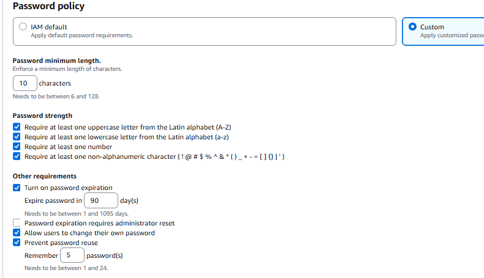
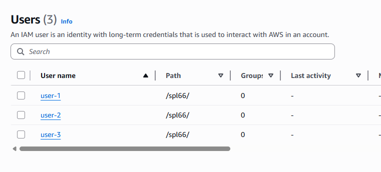
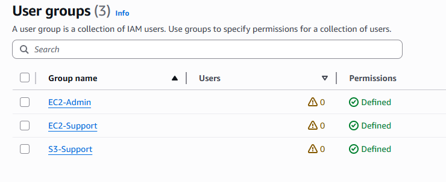
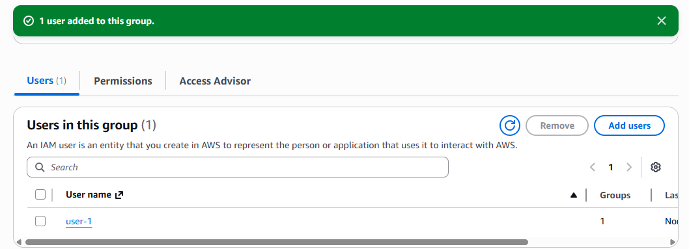
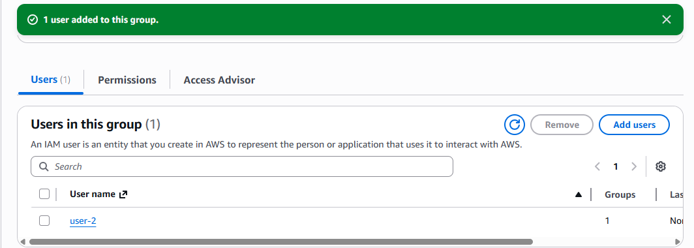
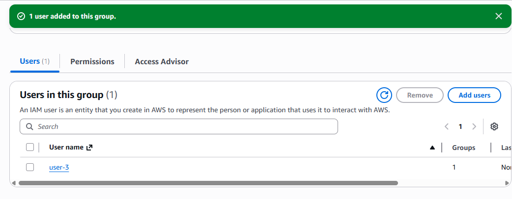
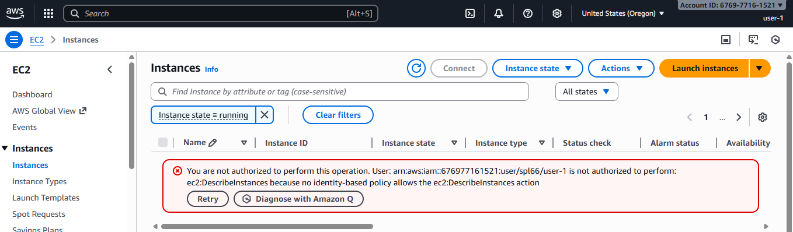
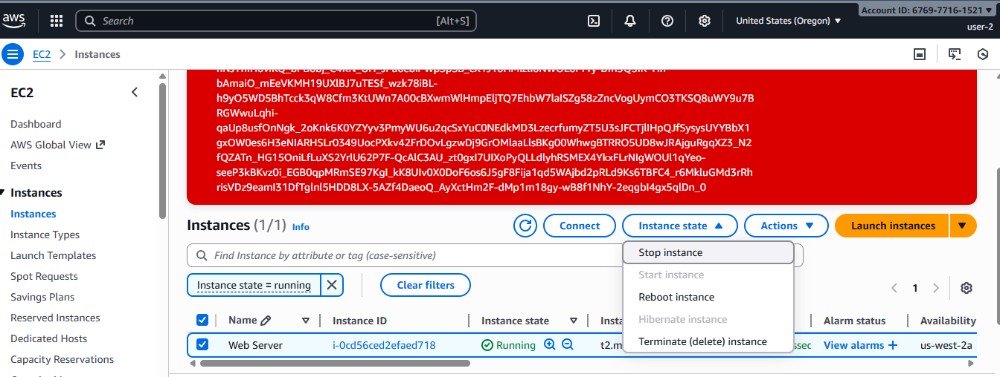
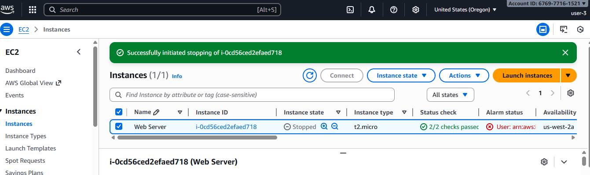
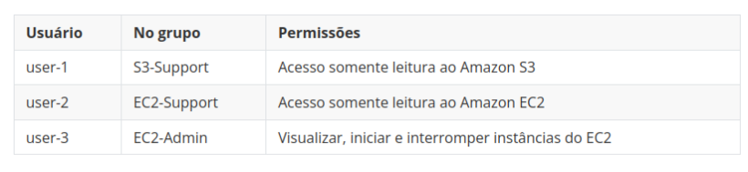

# 🔐 Documentação: Introdução ao AWS Identity and Access Management (IAM)

Este repositório apresenta a documentação prática do laboratório **“Introdução ao AWS IAM”**, desenvolvido no âmbito das atividades do programa **AWS re/Start – Escola da Nuvem**.

O laboratório teve como finalidade explorar os fundamentos de gerenciamento de identidades e acessos na AWS, incluindo a criação e administração de usuários, grupos e políticas de permissão. Foram aplicados conceitos como o 
princípio do menor privilégio, além da validação prática do comportamento de diferentes tipos de políticas (gerenciadas e inline) e seu impacto no controle de acesso aos recursos.

---

## 🧠 Habilidades Adquiridas

* Configuração e gerenciamento de políticas de senha no AWS IAM
* Análise de usuários e grupos previamente provisionados no IAM
* Identificação e distinção entre políticas gerenciadas e políticas inline
* Associação de usuários a grupos específicos para aplicação de permissões
* Validação prática de permissões por meio do acesso autenticado com diferentes perfis de usuário
---

## 🛠️ Tecnologias Utilizadas

<div align="left">

  
  
  

</div>


---

## 📁 Estrutura do Repositório

`conhecendo-IAM-AWS`

```
├── banco-de-imagem/
└── README.md
```

---

## 🧩 Cenário do Laboratório

O ambiente de laboratório forneceu 3 usuários IAM e 3 grupos com permissões distintas para realizar testes práticos:

| Usuário  | Grupo IAM     | Permissões                                          |
| :------- | :------------ | :-------------------------------------------------- |
| `user-1` | `S3-Support`  | Leitura de buckets e objetos no Amazon S3           |
| `user-2` | `EC2-Support` | Visualização de instâncias EC2 (read-only)          |
| `user-3` | `EC2-Admin`   | Controle total sobre instâncias EC2 (inline policy) |

---

## 🖥️ Etapas Realizadas

### 1. Criando e Aplicando a Política de Senhas

No console do **IAM**, foi configurada uma política de senha para toda as contas da AWS:

* **Tamanho mínimo:** 10 caracteres
* **Exigir:** letras maiúsculas, minúsculas, números e caracteres especiais
* **Permitir alteração de senha pelo usuário**
* **Expiração:** 90 dias
* **Evitar reuso das últimas:** 5 senhas anteriores

#### Tela de configuração:



---

### 2. Explorando Usuários e Grupos

Acessei o menu **Users**



Depois, em **User groups**, analisei os grupos disponíveis:



Cada grupo possui diferentes tipos de políticas:

* `S3-Support`: política gerenciada **AmazonS3ReadOnlyAccess**
* `EC2-Support`: política gerenciada **AmazonEC2ReadOnlyAccess**
* `EC2-Admin`: política **inline** com permissões de controle total em EC2

#### Exemplo de tela de permissões do grupo EC2-Support:

```JSON
{
    "Version": "2012-10-17",
    "Statement": [
        {
            "Effect": "Allow",
            "Action": [
                "ec2:Describe*",
                "ec2:GetSecurityGroupsForVpc"
            ],
            "Resource": "*"
        },
        {
            "Effect": "Allow",
            "Action": "elasticloadbalancing:Describe*",
            "Resource": "*"
        },
        {
            "Effect": "Allow",
            "Action": [
                "cloudwatch:ListMetrics",
                "cloudwatch:GetMetricStatistics",
                "cloudwatch:Describe*"
            ],
            "Resource": "*"
        },
        {
            "Effect": "Allow",
            "Action": "autoscaling:Describe*",
            "Resource": "*"
        }
    ]
}

```

#### Exemplo de tela de permissões do grupo S3-Support:

```JSON
{
    "Version": "2012-10-17",
    "Statement": [
        {
            "Effect": "Allow",
            "Action": [
                "s3:Get*",
                "s3:List*",
                "s3:Describe*",
                "s3-object-lambda:Get*",
                "s3-object-lambda:List*"
            ],
            "Resource": "*"
        }
    ]
}

```

#### Exemplo de tela de permissões do grupo EC2-Admint:

```JSON
{
    "Version": "2012-10-17",
    "Statement": [
        {
            "Action": [
                "ec2:Describe*",
                "ec2:StartInstances",
                "ec2:StopInstances"
            ],
            "Resource": [
                "*"
            ],
            "Effect": "Allow"
        }
    ]
}

```
---

### 3. Associando Usuários aos Grupos

Cada usuário foi adicionado ao seu respectivo grupo:

| Usuário  | Grupo Adicionado |
| :------- | :--------------- |
| `user-1` | `S3-Support`     |
| `user-2` | `EC2-Support`    |
| `user-3` | `EC2-Admin`      |

#### Tela de adição de usuários a grupos:







---

### 4. Testando as Permissões de Cada Usuário

Para os testes, foi utilizado o **IAM user sign-in link** da conta em janelas anônimas separadas.

#### 🔹 user-1 (S3-Support)

* ✔Acesso bem-sucedido ao **Amazon S3**
* ✔Conseguiu listar e visualizar buckets
* ❌Tentativa de acessar EC2 resultou em **Access Denied**



---

#### 🔹 user-2 (EC2-Support)

* ✔Acesso ao **Amazon EC2** autorizado apenas para visualização
* ❌Não foi possível parar ou iniciar instâncias



---

#### 🔹 user-3 (EC2-Admin)

* ✔Permissão total sobre instâncias EC2 (inline policy)
* ✔Conseguiu parar e iniciar instâncias



---

## 🧩 Resultado Final

O teste prático confirmou o funcionamento correto das políticas IAM:



---

## 🔐 O que eu Aprendi:

* Aplicar o princípio do menor privilégio fortalece a segurança e mantém o acesso sob controle.
* Políticas inline são indicadas para tratar exceções ou necessidades específicas.
* O IAM permite centralizar a autenticação e a autorização de recursos.
* O uso de grupos simplifica e agiliza o gerenciamento em ambientes de grande escala.
* A adoção de políticas de senha fortes ajuda a reduzir o risco de comprometimento de contas.

---

⚠️ ***Observação***

**Este laboratório foi executado em um ambiente sandbox da AWS, disponibilizado exclusivamente para fins educacionais. Nesse tipo de ambiente, o acesso é temporário, e todos os recursos são automaticamente finalizados e removidos ao término da sessão.**

**Informações como o Account ID ou o nome de usuário do laboratório podem aparecer nas capturas de tela, mas não apresentam riscos de segurança, pois não estão vinculadas a uma conta real e não possibilitam qualquer tipo de acesso externo.**
